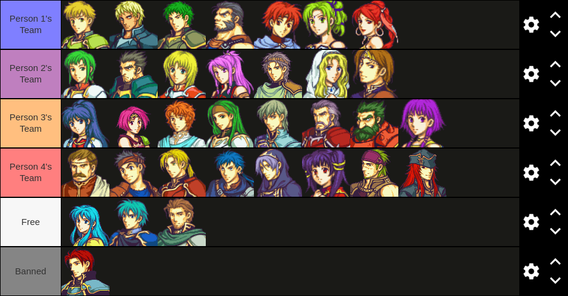

# Tactical Draft Random Generator
TDRG was inspired by "Drafts" which are commonly done in some games where players
will draft the cast of playable characters. Drafted characters are then the only
characters that are usable during the playthrough.

For example: There are four people who want to play through a fun Fire Emblem:
Sacred Stones draft. A regular draft, when completed, might look like this:

(note: Image for example purposes only, tool does not generate image.)

There isn't a lot of time and/or the four people don't
want to sit through a whole draft session so they use TDRG to generate the
teams for them. TDRG takes text files with the games' roster as input. The
group of drafters picks the FE8.txt file, recieves their teams, and is
ready to play in seconds!

The end goal for TDRG is to have as many games as possible available to
streamline the process of getting into a draft. If you make a text file for a
game that TDRG doesn't already have, I strongly urge you to [contribute](
https://github.com/quigley-c/tdrg/compare)!

## Quickstart

To run TDRG you'll need to make sure you have [python](
https://www.python.org/downloads/) installed on your PC.

To run the tool first clone the github repository via ssh or https. The link
to do so can be found at the top of the repository page. To clone from the
command line (linux / unix) use the `git` command as follows:

ssh: `git clone git@github.com/quigley-c/trdg.git`

http: `git clone https://github.com/quigley-c/tdrg/`

Once the tool has been cloned it can be run. As mentioned before it is run
with the `python` command. The complete command looks like this:

`python randomizer.py <filename> <num. players>`

TDRG takes two (2) inputs: the text file containing the roster for the draft
eg. `fe8.txt`, and the number of players eg. `4`.

## Roster text file generation

The text file for the roster is formatted specially to allow for the different
features associated with a normal draft. These features are:

	- The generation of teams
	- The exclusion of banned and/or free-to-use characters
	- The coupling of characters that require each other to acqire

This is accomplished through text formatting in the .txt file. Each group of
characters is listed on it's own line in the .txt file.

	- The first line is for the general roster of characters.
	- The second line is for the excluded characters.
	- The third line is for coupled characters.

Lines one (1) and two (2) are comma separated lists of names. The third line,
for the coupled characters, are comma separated couples of colon-delineated
characters. Eg. `Marisa:Amelia,Ewan:L'Arachel,...`
